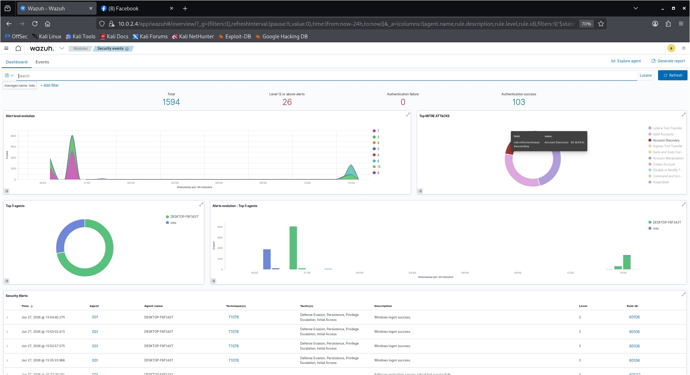
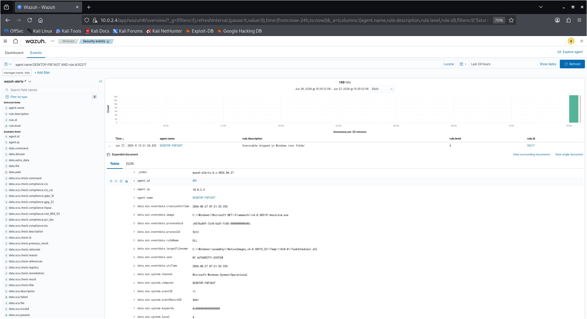
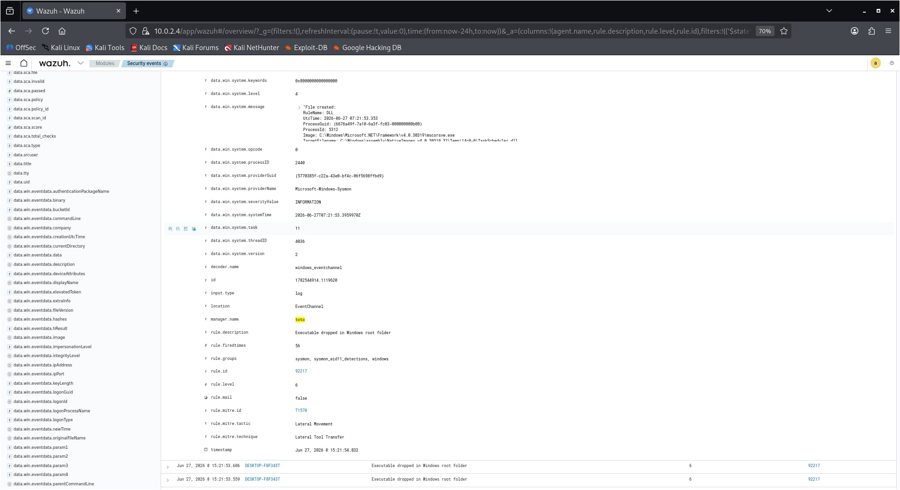

# 🛡️ SOC Home Lab — Wazuh SIEM + Sysmon + Kali Linux

A home Security Operations Center (SOC) lab built using VirtualBox for practicing attack simulation, log collection, and alert detection using Wazuh SIEM.

---

## 📋 Table of Contents
- [Lab Overview](#lab-overview)
- [Environment Setup](#environment-setup)
- [VM Configuration](#vm-configuration)
- [Wazuh SIEM Setup](#wazuh-siem-setup)
- [Sysmon Installation](#sysmon-installation)
- [Wazuh Agent Configuration](#wazuh-agent-configuration)
- [Attack Simulation — Nmap Scan](#attack-simulation--nmap-scan)
- [Detection & Alert Analysis](#detection--alert-analysis)
- [MITRE ATT&CK Mapping](#mitre-attck-mapping)
- [Key Findings](#key-findings)

---

## 🏗️ Lab Overview

This lab simulates a real-world SOC environment with:
- A **Windows 10 target machine** monitored by Sysmon and Wazuh Agent
- A **Kali Linux attacker machine** for offensive simulation
- An **Ubuntu Server** running Wazuh SIEM for centralized log collection and alerting

### Architecture Diagram

```
┌─────────────────────────────────────────────────┐
│              VirtualBox NAT Network              │
│                  soclab (10.0.2.0/24)            │
│                                                  │
│  ┌──────────────┐      ┌──────────────────────┐  │
│  │  Kali Linux  │─────▶│   demoWIN (Target)   │  │
│  │  10.0.2.15   │ scan │   10.0.2.3           │  │
│  │  (Attacker)  │      │   Windows 10         │  │
│  └──────────────┘      │   Sysmon + Agent     │  │
│                        └──────────┬───────────┘  │
│                                   │ logs          │
│                        ┌──────────▼───────────┐  │
│                        │   Ubuntu Server      │  │
│                        │   10.0.2.4           │  │
│                        │   Wazuh SIEM         │  │
│                        └──────────────────────┘  │
└─────────────────────────────────────────────────┘
```

---

## 🖥️ Environment Setup

### Host Machine
| Spec | Details |
|------|---------|
| Laptop | Asus TUF A15 |
| CPU | AMD Ryzen 7 |
| RAM | 16GB |
| GPU | RTX 3050 |
| Hypervisor | Oracle VirtualBox |

### Virtual Machines
| VM | OS | IP Address | Role |
|----|-----|------------|------|
| demoWIN | Windows 10 Pro | 10.0.2.3 | Target Machine |
| kali | Kali Linux | 10.0.2.15 | Attacker Machine |
| ubuntu-server | Ubuntu Server 22.04 | 10.0.2.4 | Wazuh SIEM Server |

### Network Configuration
- **Type:** NAT Network
- **Network Name:** soclab
- **Subnet:** 10.0.2.0/24

---

## ⚙️ VM Configuration

### Step 1: Create NAT Network in VirtualBox
1. Open VirtualBox → **File → Preferences → Network**
2. Click **"+"** to add new NAT Network
3. Set name: `soclab`
4. Set CIDR: `10.0.2.0/24`
5. Click **OK**

### Step 2: Assign NAT Network to each VM
For each VM (demoWIN, Kali, Ubuntu):
1. Right-click VM → **Settings → Network**
2. Change **Attached to:** `NAT Network`
3. Set **Name:** `soclab`
4. Click **OK**

### Step 3: Set Static IPs

**demoWIN (Windows 10):**
- Open Network Settings → Change adapter options
- Set static IP: `10.0.2.3`
- Subnet: `255.255.255.0`
- Gateway: `10.0.2.1`

**Ubuntu Server:**
```bash
sudo nano /etc/netplan/00-installer-config.yaml
```
```yaml
network:
  ethernets:
    enp0s3:
      addresses: [10.0.2.4/24]
      gateway4: 10.0.2.1
      nameservers:
        addresses: [8.8.8.8]
  version: 2
```
```bash
sudo netplan apply
```

---

## 🔧 Wazuh SIEM Setup

### Install Wazuh on Ubuntu Server (10.0.2.4)

```bash
# Download Wazuh installation script
curl -sO https://packages.wazuh.com/4.7/wazuh-install.sh

# Run the installer
sudo bash wazuh-install.sh -a

# Check Wazuh Manager status
sudo systemctl status wazuh-manager
```

### Access Wazuh Dashboard
- URL: `https://10.0.2.4`
- Default user: `admin`
- Password: *(generated during install — save this!)*

### Enable Log Archiving
Edit Wazuh manager config:
```bash
sudo nano /var/ossec/etc/ossec.conf
```

Find the `<global>` section and set:
```xml
<global>
  <logall>yes</logall>
  <logall_json>yes</logall_json>
</global>
```

Restart Wazuh manager:
```bash
sudo systemctl restart wazuh-manager
```

---

## 🔍 Sysmon Installation

### Install Sysmon on demoWIN (Windows 10)

1. Download Sysmon from [Microsoft Sysinternals](https://docs.microsoft.com/en-us/sysinternals/downloads/sysmon)
2. Open PowerShell as Administrator and run:
```powershell
# Install with default config
.\Sysmon64.exe -accepteula -i
```

3. Verify Sysmon is running:
```cmd
sc query sysmon64
```
Expected output: `STATE: 4 RUNNING`

---

## 🤝 Wazuh Agent Configuration

### Install Wazuh Agent on demoWIN

1. Go to Wazuh Dashboard → **Agents → Deploy New Agent**
2. Select:
   - Package: **Windows**
   - Architecture: **x86_64**
   - Wazuh Server IP: `10.0.2.4`
   - Agent Name: `demoWIN`
3. Copy the generated PowerShell command and run as Administrator on demoWIN

### Configure Agent to Forward Sysmon Logs

Edit ossec.conf on demoWIN using Notepad as Administrator:

1. Press **Win + S** → type `notepad`
2. Right-click Notepad → **Run as administrator**
3. Click **Yes** on UAC prompt
4. Inside Notepad, click **File → Open**
5. Sa file path bar sa taas, i-type:
```
C:\Program Files (x86)\ossec-agent\ossec.conf
```
6. Sa bottom right, change filter from `Text Documents (*.txt)` → **All Files (*.*)**
7. Click **Open**
8. Scroll down to the very bottom of the file
9. Add this block **before** `</ossec_config>`:

```xml
<!-- Sysmon log collection -->
<localfile>
  <location>Microsoft-Windows-Sysmon/Operational</location>
  <log_format>eventchannel</log_format>
</localfile>
```

10. Press **CTRL+S** to save

### Restart Wazuh Agent
```cmd
sc start WazuhSvc

# Verify running
sc query WazuhSvc
```
Expected: `STATE: 4 RUNNING`


### Verify Logs are Arriving (on Ubuntu)
```bash
sudo grep -i "sysmon" /var/ossec/logs/archives/archives.log | tail -20
```

**Before fix** — walang output, Sysmon logs not arriving:


**Fix 2: Edit Wazuh Manager ossec.conf** — change logall to yes:


**After fix** — Sysmon logs now flowing to Wazuh! ✅


---

## 🔧 Troubleshooting — Enabling Sysmon Log Forwarding

Before alerts appeared in Wazuh, two critical fixes were needed:

### Fix 1: Enable Log Archiving on Wazuh Manager

By default, Wazuh does NOT archive all logs. Without this, Sysmon events won't appear in the dashboard.

SSH into Ubuntu Server and edit the Wazuh manager config:
```bash
sudo nano /var/ossec/etc/ossec.conf
```

Find the `<global>` section — change `no` to `yes`:
```xml
<global>
  <logall>yes</logall>
  <logall_json>yes</logall_json>
</global>
```

Save (`CTRL+X` → `Y` → `Enter`) then restart:
```bash
sudo systemctl restart wazuh-manager
```

---

### Fix 2: Add Sysmon Entry to ossec.conf on demoWIN

The Wazuh Agent on demoWIN was NOT forwarding Sysmon logs by default. Verification:
```bash
# Run on Ubuntu — if no output, Sysmon logs not arriving
sudo grep -i "sysmon" /var/ossec/logs/archives/archives.log | tail -20
```

**Fix:** On demoWIN, open Notepad as Administrator and edit:
```
C:\Program Files (x86)\ossec-agent\ossec.conf
```

Add this block before `</ossec_config>`:
```xml
<!-- Sysmon log collection -->
<localfile>
  <location>Microsoft-Windows-Sysmon/Operational</location>
  <log_format>eventchannel</log_format>
</localfile>
```

Save the file, then restart the Wazuh Agent via CMD (Administrator):
```cmd
sc stop WazuhSvc
sc start WazuhSvc

# Verify
sc query WazuhSvc
```
Expected: `STATE: 4 RUNNING`

---

### Verify Fix Worked

Run on Ubuntu again:
```bash
sudo grep -i "sysmon" /var/ossec/logs/archives/archives.log | tail -20
```
✅ If JSON output appears with `Microsoft-Windows-Sysmon` — logs are now flowing!

---

## ⚔️ Attack Simulation — Nmap Scan

### Run Nmap from Kali Linux (10.0.2.15)

```bash
# SYN scan with service detection on top 1000 ports
nmap -sS -sV -p 1-1000 10.0.2.3
```

### Nmap Scan Results
```
PORT    STATE  SERVICE       VERSION
135/tcp open   msrpc         Microsoft Windows RPC
139/tcp open   netbios-ssn   Microsoft Windows netbios-ssn
445/tcp open   microsoft-ds
MAC Address: 08:00:27:44:5F:E6 (Oracle VirtualBox)
OS: Windows; CPE: cpe:/o:microsoft:windows
```

The screenshot below shows **Nmap attack on Kali (right)** while **Ubuntu captures Sysmon logs in real-time (left)**:


### Monitor Real-time on Ubuntu
```bash
sudo tail -f /var/ossec/logs/archives/archives.log | grep -i "10.0.2.15"
```

---

## 📊 Detection & Alert Analysis

### Wazuh Security Events Dashboard

After the Nmap scan, Wazuh showed **1,594 total alerts** with **26 high-severity (Level 12+)** alerts and multiple MITRE ATT&CK mappings including **Account Discovery**.



---

### Finding Nmap-Related Alerts

Using Lucene search in the Events tab:

```
agent.name:DESKTOP-F8F343T AND rule.id:92217
```

This returned **149 hits** — all triggered during the Nmap scan window.



---

### Alert Deep Dive — Rule 92217

Expanding the alert showed full forensic details including MITRE ATT&CK mapping:



#### Key Fields from the Alert:

| Field | Value |
|-------|-------|
| **Rule ID** | 92217 |
| **Rule Description** | Executable dropped in Windows root folder |
| **Rule Level** | 6 (Medium) |
| **Fired Times** | 56 |
| **Agent Name** | DESKTOP-F8F343T |
| **Agent IP** | 10.0.2.3 |
| **Log Source** | Microsoft-Windows-Sysmon/Operational |
| **Sysmon Event ID** | 11 (File Created) |
| **Process Image** | `C:\Windows\Microsoft.NET\Framework\v4.0.30319\mscorsvw.exe` |
| **Target Filename** | `C:\Windows\assembly\NativeImages_v4.0.30319_32\Temp\14c0-0\TaskScheduler.dll` |
| **User** | NT AUTHORITY\SYSTEM |
| **Rule Groups** | sysmon, sysmon_eid11_detections, windows |

---

## 🎯 MITRE ATT&CK Mapping

| Field | Value |
|-------|-------|
| **Technique ID** | [T1570](https://attack.mitre.org/techniques/T1570/) |
| **Tactic** | Lateral Movement |
| **Technique** | Lateral Tool Transfer |

> 📌 **Note:** Wazuh automatically maps alerts to MITRE ATT&CK techniques. While the primary goal was Nmap port scan detection, Wazuh captured Sysmon **Event ID 11 (File Created)** events triggered during the scan — mapped to T1570 (Lateral Tool Transfer).

---

## 🔑 Key Findings & Lessons Learned

**1. Sysmon + Wazuh = Powerful Visibility**
Sysmon provides deep Windows telemetry (process creation, network connections, file events) that Wazuh correlates into actionable alerts with MITRE ATT&CK context.

**2. Log Archiving Must Be Enabled**
By default, `logall` is set to `no` in Wazuh. Without setting it to `yes`, Sysmon logs won't be stored in archives and won't appear in the dashboard.

**3. ossec.conf Requires Sysmon Entry**
The Wazuh agent won't forward Sysmon logs unless the `<localfile>` entry for `Microsoft-Windows-Sysmon/Operational` is explicitly added to `ossec.conf`.

**4. SIEM Detects Behavior, Not Tool Names**
Wazuh doesn't know "this was Nmap" — it detects *patterns* (rapid connections, file drops, process creation). The SOC analyst correlates evidence to conclude the attack type. This is real SOC work.

**5. MITRE ATT&CK Context Speeds Up Investigation**
Automatic MITRE mapping (T1570 — Lateral Tool Transfer) helps analysts quickly understand the attack stage and prioritize response.

---

## 🛠️ Tools Used

| Tool | Version | Purpose |
|------|---------|---------|
| Oracle VirtualBox | Latest | Hypervisor |
| Wazuh | 4.7.5 | SIEM — alerts, dashboards, correlation |
| Sysmon | Latest | Windows telemetry |
| Kali Linux | Latest | Attack simulation |
| Nmap | 7.95 | Network port scanner |
| Ubuntu Server | 22.04 LTS | Wazuh server OS |

---

## 📚 References

- [Wazuh Documentation](https://documentation.wazuh.com)
- [Microsoft Sysmon](https://docs.microsoft.com/en-us/sysinternals/downloads/sysmon)
- [MITRE ATT&CK T1570](https://attack.mitre.org/techniques/T1570/)
- [Nmap Official Docs](https://nmap.org/docs.html)

---

*Built by Leo | Cybersecurity Student | Aspiring SOC Analyst*  
*🎯 Currently pursuing: BTL1 Certification | TryHackMe SOC Level 1*
