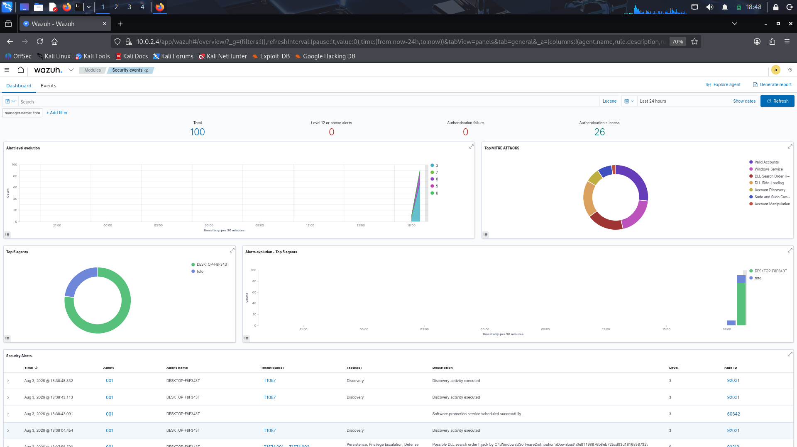
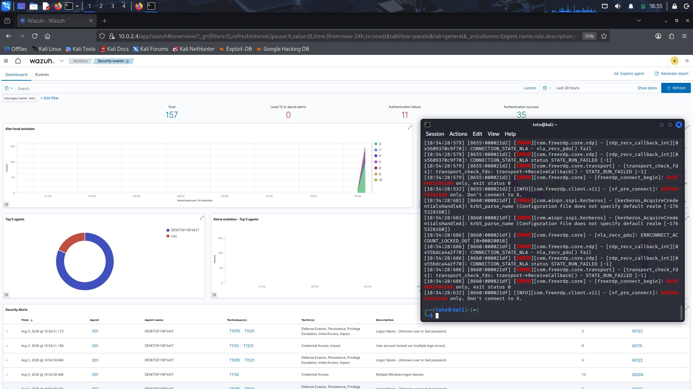
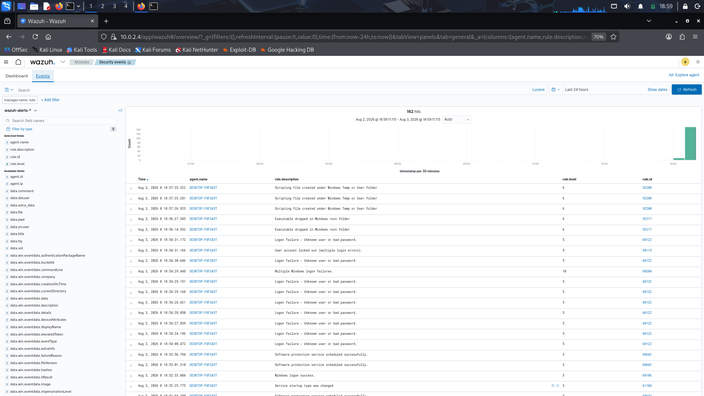
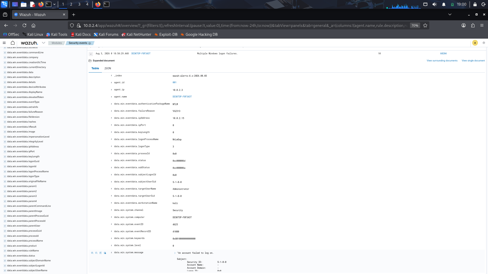
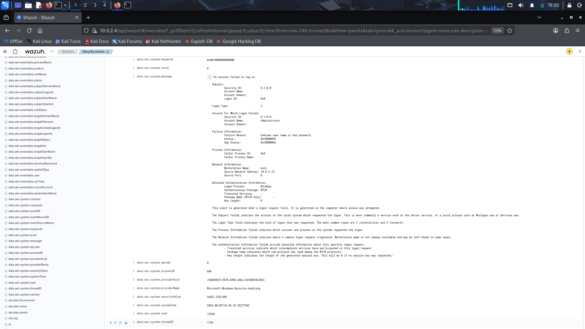
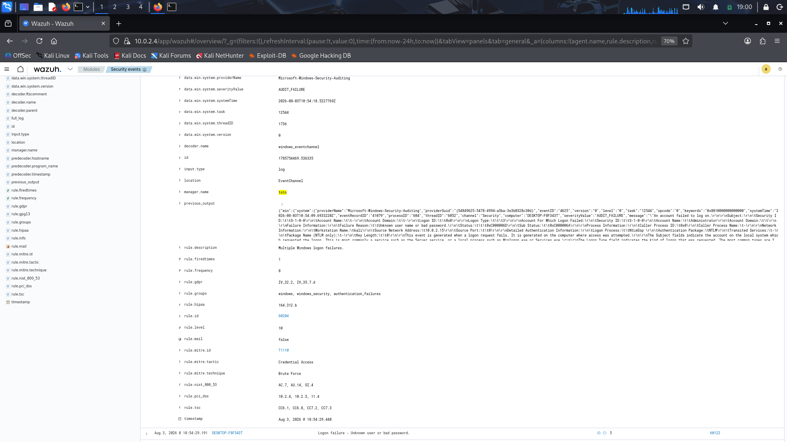

# RDP Brute Force Attack Detection

## Overview
This exercise simulates an RDP brute force attack against a Windows 10 target (`demoWIN`) from a Kali Linux attacker machine, and verifies that the Wazuh SIEM correctly detects and alerts on the activity in real time.

## Lab Environment
| Host | Role | IP |
|---|---|---|
| Ubuntu Server | Wazuh Manager / Dashboard | 10.0.2.4 |
| demoWIN (Windows 10) | Attack target | 10.0.2.3 |
| Kali Linux | Attacker | 10.0.2.15 |

This test was run in one continuous session to keep all timestamps consistent.

## Step 1 — Baseline (before attack)
Dashboard checked before running any attack to record a clean starting point:

- **Total alerts:** 100 (background Windows/Sysmon noise only)
- **Authentication failure:** 0
- **Authentication success:** 26



## Step 2 — Launch the attack
From Kali, ran repeated RDP logon attempts against `demoWIN`:

```bash
for pass in $(head -20 /usr/share/wordlists/rockyou.txt); do
  xfreerdp3 /v:10.0.2.3 /u:Administrator /p:"$pass" /cert:ignore +auth-only 2>&1 | grep -i "authentication\|error"
done
```

The terminal showed repeated `ERRCONNECT_ACCOUNT_LOCKED_OUT` and NLA authentication failures as attempts progressed.

## Step 3 — Detection in Wazuh
After the attack, the dashboard was refreshed:

- **Authentication failure:** 11 (up from 0)
- **Authentication success:** 35
- **Total alerts:** 157



## Step 4 — Alert list (Events tab)
Switched to the Events tab to see the full list of alerts generated during the attack window (162 hits), including:

| Rule ID | Level | Description | MITRE Technique |
|---|---|---|---|
| 60122 | 5 | Logon failure – Unknown user or bad password | T1078 |
| 60204 | 10 | Multiple Windows logon failures | T1110 (Brute Force) |
| 60115 | 9 | User account locked out (multiple login errors) | T1110 / T1531 |



## Step 5 — Verifying the source (Rule 60204 expanded)
Expanded the Rule 60204 event (Windows Security Event ID 4625) to confirm it genuinely originated from the attack:

- **Source Network Address:** `10.0.2.15` (Kali) — confirms the attack source
- **Workstation Name:** `kali`
- **Account For Which Logon Failed:** `Administrator`
- **Failure Reason:** Unknown user name or bad password
- **rule.frequency:** 8 (alert fired after 8 failed logons within the correlation window — threshold-based detection, not a single event)




## Step 6 — MITRE and compliance mapping
The rule detail also includes MITRE ATT&CK and compliance framework mappings:

- **MITRE:** T1110, Tactic: Credential Access, Technique: Brute Force
- **Compliance mappings:** GDPR IV_32.2 / IV_35.7.d, HIPAA 164.312.b, NIST 800-53 AC.7 / AU.14 / SI.4, PCI DSS 10.2.4 / 10.2.5 / 11.4



## Summary
| Stage | Authentication Failures |
|---|---|
| Baseline (before attack) | 0 |
| After attack | 11 |

End-to-end chain confirmed: attack execution → Windows Security event logging → Wazuh correlation rule triggering → account lockout, mapped to MITRE ATT&CK T1110 (Brute Force).
